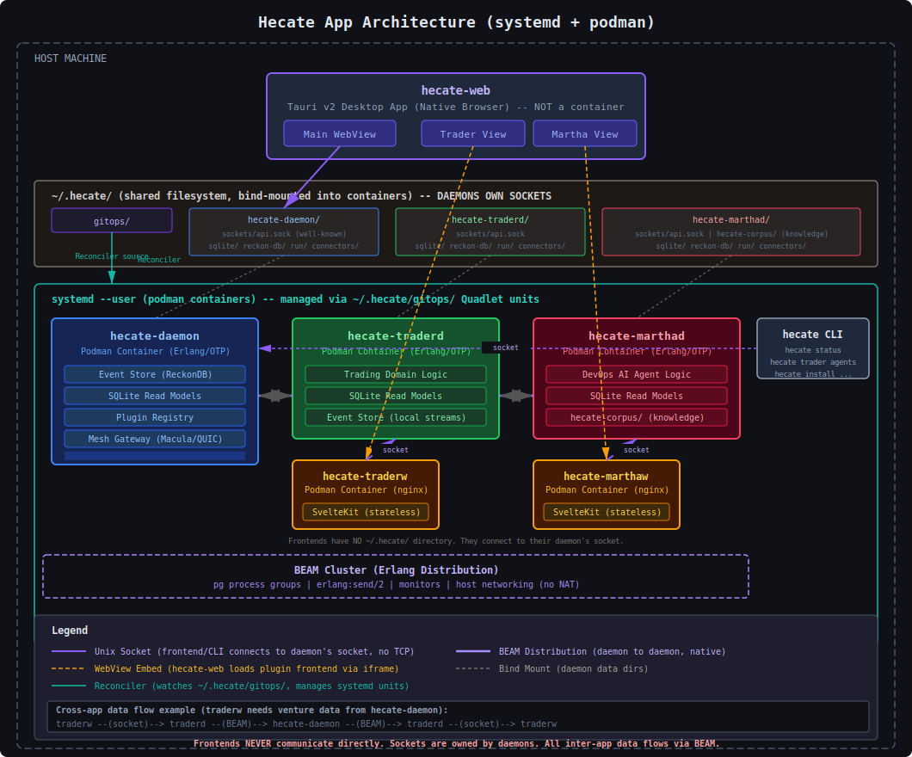

# Hecate Plugin Directory Convention

## Overview

`~/.hecate/` is the root directory for all Hecate components on a host.
It contains three categories of entries: daemon namespaces, infrastructure
configuration, and secrets. Frontends are stateless -- they connect
to their daemon's socket and have no local data directory.

The primary daemon (`hecate-daemon`) is the authority on directory layout
and acts as the plugin registry.

## The Hecate App Model

Every Hecate plugin is a **trio**: a daemon (`*d`), a web frontend (`*w`),
and CLI subcommands registered by the daemon. The daemon and frontend run
as OCI containers managed by systemd via Podman Quadlet units. The CLI
subcommands are discovered dynamically by the `hecate` CLI through the
daemon socket.

### App = Division (The Fundamental Equivalence)

**A Hecate App corresponds 1-to-1 with a Division (bounded context).**

This is the single most important architectural insight for understanding
the Hecate plugin model. The runtime deployment model (App) and the software
architecture model (Division) are the same thing viewed from different angles:

| Division Concept | Hecate App Equivalent |
|------------------|-----------------------|
| **Division** (bounded context) | **App** (plugin repo) |
| **CMD Department** (command apps) | Erlang apps under `apps/` in the daemon |
| **PRJ Department** (projection apps) | Erlang apps under `apps/` in the daemon |
| **QRY Department** (query apps) | Erlang apps under `apps/` in the daemon |
| **Desks** (vertical slices) | Directories within each Erlang app + frontend slices |
| **Dossier** (aggregate) | ReckonDB event streams in the daemon's store |

The daemon IS the Division's runtime. Its Erlang umbrella apps ARE the
CMD/PRJ/QRY departments. The frontend's vertical slices ARE the user-facing
aspect of the desks.

**Example — Martha:**

```
Martha App = Martha Division (the ALC bounded context)

Daemon (hecate-marthad):
  apps/guide_venture_lifecycle/     = CMD department (domain process)
  apps/guide_division_alc/          = CMD department (division process)
  apps/query_venture_lifecycle/     = QRY+PRJ department (domain reads)
  apps/query_division_alc/          = QRY+PRJ department (division reads)

Frontend (hecate-marthaw):
  brainstorm_venture_events/        = UI for domain storm desk
  design_division/                  = UI for design desk
  plan_division/                    = UI for planning desk
  ...etc
```

**Why this matters:**

1. **One repo per Division** -- a Division is not scattered across repos
2. **Daemon owns all state** -- CMD writes events, PRJ builds read models,
   QRY serves them. The frontend is stateless.
3. **BEAM clustering for cross-Division** -- Divisions (daemons) communicate
   via pg process groups, not APIs. Just like departments within a company
   talk internally, not through formal contracts.
4. **Mesh for cross-node** -- When Divisions on different machines need to
   communicate, they use the Macula mesh (integration facts, not domain events).
5. **Frontend never crosses Division boundaries** -- Each frontend talks only
   to its own daemon. If it needs data from another Division, the daemon
   proxies via BEAM clustering.

See [CARTWHEEL.md](../philosophy/CARTWHEEL.md) for the Division architecture
blueprint, [MARTHA_PLUGIN_ARCHITECTURE.md](MARTHA_PLUGIN_ARCHITECTURE.md)
for a full CQRS example, and [OBSERVATION_PLUGIN_PATTERN.md](OBSERVATION_PLUGIN_PATTERN.md)
for a read-only observation plugin (no ReckonDB, no evoq -- just erpc polling).

| Component | Role | Runtime | Deployed as |
|-----------|------|---------|-------------|
| `hecate-daemon` | Primary daemon, plugin registry | Erlang/OTP | podman container (systemd) |
| `hecate-web` | Native desktop shell, renders all frontends | Tauri v2 (Rust + SvelteKit) | Install script |
| `hecate-traderd` | Trading plugin daemon | Erlang/OTP | podman container (systemd) |
| `hecate-traderw` | Trading plugin frontend | SvelteKit | podman container (systemd) |
| `hecate-marthad` | DevOps AI agent daemon | Erlang/OTP | podman container (systemd) |
| `hecate-marthaw` | DevOps AI agent frontend | SvelteKit | podman container (systemd) |
| `hecate-app-meshviewd` | Mesh observer daemon (read-only) | Erlang/OTP | podman container (systemd) |
| `hecate-app-meshvieww` | Mesh observer frontend | SvelteKit | podman container (systemd) |

### Plugin Three Parts

Every plugin consists of exactly three parts:

| Part | What it is | Lifecycle |
|------|-----------|-----------|
| **Daemon** (`*d`) | OCI container running Erlang/OTP, owns all state | Long-running systemd service |
| **Web Frontend** (`*w`) | OCI container running SvelteKit, stateless | Long-running systemd service |
| **CLI Subcommands** | Registered by daemon, discovered via socket | On-demand per CLI invocation |

The daemon is the authority. The frontend renders what the daemon provides.
The CLI gives headless/SSH access to the same functionality.

### Communication Rules

1. **Frontend to its daemon** -- Unix domain sockets only. No TCP/HTTP.
   Socket files live in `~/.hecate/{daemon}/sockets/` (bind-mounted into
   containers).
2. **Daemon to daemon** -- BEAM-native clustering (pg process groups,
   `erlang:send/2`, monitors). Zero-config within a host. No APIs needed.
3. **Frontend to frontend** -- NEVER. All inter-app data flows through
   daemons via BEAM clustering.
4. **hecate-web to plugin frontends** -- WebView embed. hecate-web loads
   plugin frontends as embedded webviews. The data channel from that
   webview to the plugin daemon goes via Unix socket.
5. **Daemon-as-proxy** -- When hecate-web requests a plugin that is not
   installed locally, the daemon forwards the request to a cluster peer
   that has it. The user sees remote plugins seamlessly.

### Architecture Diagram



## Directory Structure

```
~/.hecate/                                  # Root for all Hecate components
  #
  # --- Infrastructure ---
  #
  gitops/                                   # Per-node source of truth for systemd units
    system/
      hecate-daemon.container               # Core daemon Quadlet unit
    apps/
      hecate-trader/
        traderd.container                   # Plugin daemon Quadlet unit
        traderw.container                   # Plugin frontend Quadlet unit
      hecate-martha/
        marthad.container                   # AI agent daemon Quadlet unit
        marthaw.container                   # AI agent frontend Quadlet unit
    config/
      node.toml                            # Node-specific configuration

  secrets/                                  # Encryption keys (sops + age)
    age.key                                 # Private key (mode 0600)
    age.pub                                 # Public key

  #
  # --- Daemon Namespaces (standard structure) ---
  #
  hecate-daemon/                            # Primary daemon (always present)
    sqlite/                                 # SQLite read-model databases
    reckon-db/                              # ReckonDB (Khepri/Ra) event store data
    sockets/                                # Unix domain sockets
      api.sock                              # Well-known bootstrap socket
    run/                                    # PID and state files
      daemon.pid
      daemon.state
    connectors/                             # Connector socket files

  hecate-traderd/                           # Trading plugin daemon
    sqlite/
    reckon-db/
    sockets/
      api.sock
    run/
      daemon.pid
      daemon.state
    connectors/

  hecate-marthad/                           # DevOps AI agent daemon
    sqlite/
    reckon-db/
    sockets/
      api.sock
    run/
      daemon.pid
      daemon.state
    connectors/
    hecate-corpus/                           # Cloned knowledge base (AI instructions)
```

Frontends (hecate-traderw, hecate-marthaw, etc.) are stateless containers.
They connect to their daemon's socket (e.g. `~/.hecate/hecate-traderd/sockets/api.sock`)
but do NOT have their own directory under `~/.hecate/`. Sockets are owned
by daemons.

## Three Categories

### 1. Daemon Namespaces

Every Erlang daemon gets the full standard structure:

| Subdirectory | Purpose |
|-------------|---------|
| `sqlite/` | SQLite read-model databases |
| `reckon-db/` | ReckonDB (Khepri/Ra) event store data |
| `sockets/` | Unix domain sockets (including `api.sock`) |
| `run/` | PID files, state files |
| `connectors/` | Connector socket files |

Daemons that include an AI agent (like `hecate-marthad`) may also have
a cloned knowledge base directory (e.g. `hecate-corpus/`).

Frontends do NOT get their own namespace. They are stateless containers
that connect to their daemon's socket via bind mount.

### 2. Infrastructure

The gitops directory is the per-node source of truth for all deployments:

| Directory | Purpose |
|-----------|---------|
| `gitops/` | Per-node source of truth. The local reconciler watches this directory and manages systemd units accordingly. |

The gitops directory contains Podman Quadlet `.container` files organized
by component. The local reconciler detects changes and creates, updates,
or removes the corresponding `systemd --user` units.

Infrastructure directories do NOT follow the daemon namespace structure.

### 3. Secrets

Encryption keys for secret management (sops + age):

| Directory | Purpose |
|-----------|---------|
| `secrets/` | Age keypair for encrypting/decrypting secrets in gitops config files. |

The private key (`age.key`) must be mode 0600. Secrets in `gitops/config/`
are encrypted with sops using this key.

## Required Plugin Daemon HTTP Endpoints

Every plugin daemon MUST serve these HTTP endpoints on its Unix socket
for hecate-web to discover and render the plugin:

| Endpoint | Handler | Purpose |
|----------|---------|---------|
| `GET /health` | Custom handler | Health check (200 OK = alive) |
| `GET /manifest` | Custom handler | Plugin metadata (name, version, icon, description, tag) |
| `GET /ui/[...]` | `cowboy_static` | Frontend custom element (component.js) served from `priv/static/` |

### Why All Three Are Required

hecate-web discovers plugins by scanning for Unix sockets, then:

1. **Fetches `/manifest`** to get plugin name, icon, description, version
2. **Loads `/ui/component.js`** as a web component (custom element)
3. If `/ui/component.js` returns 404, **the plugin is silently dropped**

A plugin with a working daemon and manifest but no `/ui/[...]` route
will appear to not exist in the hecate-web UI.

### Cowboy Route Pattern

```erlang
start_cowboy() ->
    StaticDir = static_dir(),
    Routes = [
        {"/health", my_plugin_health_api, []},
        {"/manifest", my_plugin_manifest_api, []},
        {"/ui/[...]", cowboy_static, {dir, StaticDir, [{mimetypes, cow_mimetypes, all}]}},
        %% ... plugin-specific API routes ...
    ],
    Dispatch = cowboy_router:compile([{'_', Routes}]),
    %% ...

static_dir() ->
    PrivDir = code:priv_dir(my_plugin_app),
    filename:join(PrivDir, "static").
```

### Manifest Response Format

```json
{
  "name": "my-plugin",
  "version": "0.1.0",
  "icon": "\uD83D\uDD27",
  "description": "What this plugin does",
  "tag": "my-plugin-studio"
}
```

The `tag` field is the custom element tag name that the frontend JS
registers via `customElements.define()`.

### Frontend Build Pipeline (Dockerfile)

The Dockerfile must build the frontend and copy the output into the
daemon's `priv/static/` before building the Erlang release:

```dockerfile
# Stage 1: Build frontend as ES module
FROM node:22-alpine AS frontend
WORKDIR /frontend
COPY my-pluginw/ .
RUN npm ci && npm run build:lib

# Stage 2: Build Erlang release
FROM erlang:27-alpine AS backend
WORKDIR /build
COPY my-plugind/ .
RUN rebar3 get-deps && rebar3 compile
COPY --from=frontend /frontend/dist priv/static/   # <-- CRITICAL
RUN rebar3 as prod release
```

Without the `COPY --from=frontend` line, `priv/static/` will be empty
and `/ui/component.js` will 404.

## Rules

1. **One directory per daemon** -- `~/.hecate/{daemon-name}/`
2. **Consistent subdirectories** -- every daemon uses the same internal
   layout (`sqlite/`, `reckon-db/`, `sockets/`, `run/`, `connectors/`)
3. **Daemon names are unique** -- lowercase, hyphenated (e.g. `hecate-traderd`)
4. **Naming convention** -- daemons end in `d`, frontends end in `w`
5. **Sockets are owned by daemons** -- frontends connect to their daemon's
   socket, they do not have their own
6. **Well-known bootstrap socket** -- `~/.hecate/hecate-daemon/sockets/api.sock`
   is the ONE path all plugin daemons use to find the primary daemon
7. **hecate-daemon is the authority** -- it creates namespace directories
   and tracks registered plugins
8. **All deployments via gitops** -- `~/.hecate/gitops/` is the single
   source of truth. The local reconciler watches it and manages systemd
   units. The only exception is `hecate-web` which uses the install script.
9. **Multi-user** -- `~` resolves per-user, so each user gets their own
   `~/.hecate/` tree with their own systemd --user services

## Bootstrap Flow

A plugin daemon starts by connecting to the well-known socket:

```
1. Plugin container starts (systemd unit created by reconciler from gitops)
2. Connects to ~/.hecate/hecate-daemon/sockets/api.sock (bind-mounted)
3. POST /api/plugins/register { "name": "hecate-traderd" }
4. hecate-daemon creates ~/.hecate/hecate-traderd/{sqlite,reckon-db,...}
5. Returns the assigned paths to the plugin
6. Plugin daemon uses those paths for all its data
7. Plugin daemon joins BEAM cluster for inter-daemon communication
```

## Plugin Registration API

### Register a plugin daemon

```
POST /api/plugins/register
Content-Type: application/json

{
  "name": "hecate-traderd",
  "version": "0.1.0",
  "description": "Trading daemon for Hecate"
}

Response 201:
{
  "name": "hecate-traderd",
  "base_dir": "/home/user/.hecate/hecate-traderd",
  "paths": {
    "sqlite":     "/home/user/.hecate/hecate-traderd/sqlite",
    "reckon_db":  "/home/user/.hecate/hecate-traderd/reckon-db",
    "sockets":    "/home/user/.hecate/hecate-traderd/sockets",
    "run":        "/home/user/.hecate/hecate-traderd/run",
    "connectors": "/home/user/.hecate/hecate-traderd/connectors"
  }
}
```

### List registered plugins

```
GET /api/plugins

Response 200:
[
  {
    "name": "hecate-traderd",
    "version": "0.1.0",
    "socket": "/home/user/.hecate/hecate-traderd/sockets/api.sock",
    "status": "running"
  }
]
```

### Deregister a plugin

```
DELETE /api/plugins/hecate-traderd

Response 200:
{ "ok": true }
```

Note: deregistration does NOT delete the plugin's data directory. Data
cleanup is a separate, explicit operation.

## Plugin CLI Subcommands

Plugins register CLI subcommands with their daemon. The `hecate` CLI
discovers available commands by querying the daemon socket.

```
$ hecate status                    # daemon health + installed plugins
$ hecate install trader            # pull OCI, write container unit, reconcile
$ hecate remove trader             # remove unit, reconcile
$ hecate logs traderd              # journalctl --user -u hecate-traderd
$ hecate trader status             # delegate to traderd via socket
$ hecate trader agents             # plugin-specific subcommand
```

Daemons export their CLI interface:

```erlang
%% traderd_cli.erl
-export([commands/0, handle_command/2]).

commands() ->
    [{<<"status">>, <<"Show trading agent status">>},
     {<<"agents">>, <<"List active agents">>}].

handle_command(<<"status">>, _Args) ->
    {ok, #{agents => 3, pnl => 142.30}}.
```

The `hecate` CLI ships with hecate-daemon and provides headless/SSH access
to all plugin functionality. There are no per-plugin CLI apps.

## Deployment Scenarios

| Scenario | How it works |
|----------|-------------|
| Single user, single laptop | Install hecate-web, auto-creates `~/.hecate/`, starts daemon. Plugins via UI. |
| Family, single laptop | Each Unix user gets own `~/.hecate/`, own `systemd --user` units, fully isolated. |
| Home cluster + laptops | Headless servers run daemon + plugins via systemd. Laptops connect via BEAM cluster. |
| Corporate | IT deploys servers however they want. Desktops = single user scenario. |

## Why This Design

| Concern | Solution |
|---------|----------|
| Plugin daemons don't hardcode conventions | They ask hecate-daemon for paths |
| Directory layout can evolve | Only hecate-daemon needs updating |
| hecate-daemon tracks what's installed | Plugin registry as source of truth |
| No conflicts between daemons | Each gets its own namespace |
| Discovery | Plugins find each other through hecate-daemon |
| Security | Unix sockets, no TCP exposure for frontend-daemon |
| Backend communication | BEAM clustering, no APIs needed |
| Deployment | Local gitops + reconciler, consistent for all components |
| Multi-user | Per-user home directory isolation |
| Headless access | CLI subcommands via daemon socket, no GUI required |
| Remote plugins | Daemon-as-proxy forwards to cluster peers transparently |

## Implementation

The directory layout is enforced by `shared_paths.erl` in hecate-daemon:

- `shared_paths:base_dir/0` -- returns `~/.hecate/hecate-daemon`
- `shared_paths:sqlite_path/1` -- returns `base_dir/sqlite/Name`
- `shared_paths:reckon_path/1` -- returns `base_dir/reckon-db/Name`
- `shared_paths:socket_path/1` -- returns `base_dir/sockets/Name`
- `shared_paths:run_path/1` -- returns `base_dir/run/Name`
- `shared_paths:connectors_dir/0` -- returns `base_dir/connectors`
- `shared_paths:ensure_layout/0` -- creates all subdirectories

The base directory is configured via `{hecate, [{data_dir, "~/.hecate/hecate-daemon"}]}`.

## Consumers

| Component | What it needs | How it finds it |
|-----------|---------------|-----------------|
| hecate-daemon (Erlang) | Everything | `shared_paths` module |
| hecate-web (Tauri/Rust) | Socket path | Hardcoded well-known path |
| hecate CLI | Socket + plugin commands | `$HOME/.hecate/hecate-daemon/sockets/api.sock` |
| Shell scripts | Socket + PID paths | `$HOME/.hecate/hecate-daemon/sockets/api.sock` |
| Plugin daemons | Their own namespace | Plugin registration API |
| Plugin frontends | Daemon socket path | Convention: `~/.hecate/{daemon}/sockets/api.sock` |
| Systemd reconciler | Quadlet unit files | `~/.hecate/gitops/` |
| AI agents (Martha) | Knowledge base | `~/.hecate/hecate-marthad/hecate-corpus/` |
